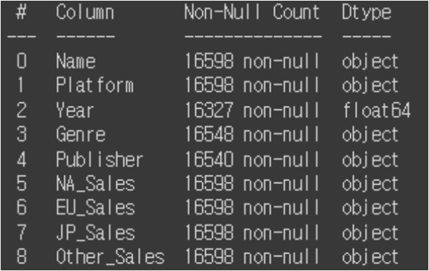
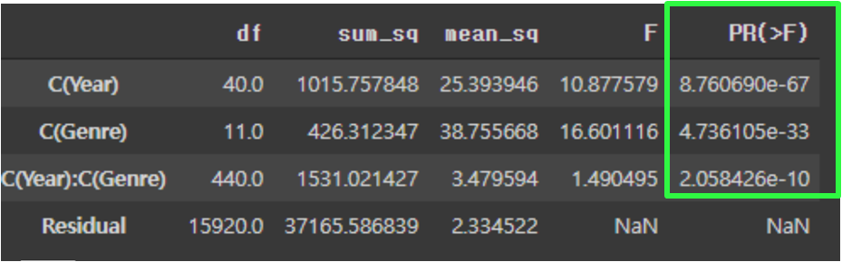

## **Which game should we launch**
 

### **사용한 데이터**
https://www.kaggle.com/datasets/gregorut/videogamesales 
1975년~2020년까지의 10만장 이상 판매된 비디오게임 데이터
  
Data preview

 
 

### **분석 목표**
비디오게임 판매 양상을 확인하고, 다음분기 어떤 게임을 개발해야 하는지 결정한다.
  

### **분석 진행 방향**
**1. 데이터 전처리** 
　- 1.1 입력값 통일 
　- 1.2 특성공학 
　- 1.3 결측값 처리 
　- 1.4 이상치 처리 
　- 1.5 검색 후 직접 입력 

**2. 데이터 분석 **
　- 2.1 국가별 선호 게임 장르 
　- 2.2 연도별 게임 트렌드 
　- 2.3 장르별 판매 실적 
　- 2.4 플랫폼별 판매 실적 

**3. 결론 도출  **

### **1. 데이터 전처리 **
> Column별 결측치가 관측되고, Dtype이 일치하지 않음을 확인

 

 

#### **1.1　입력값 통일**
> "K", "M" 단위값으로 입력되어 있는 값을 수치로 계산 후 데이터 기준단위 (100만)에 맞춰 표기 

 

 

#### **1.2　특성공학**
> 북미, 유럽, 일본, 기타 판매를 합친 특성(Tot_Sales)생성

 

 

#### **1.3　결측값 처리**
> Tot_Sales가 평균 이상인 데이터는 분석에 영향을 끼칠 것이란 판단 하, Tot_Sales가 평균미만이면서 Year, Genre, Publisher 가 결측치인 열 제거

>**총 데이터 수 16598 > 16312 로 감소**
 

 

#### **1.4　이상치 처리**
> Year이 9.0, 97.0 등 100의자리 이하로 표현된 값 정정 

 

 

#### **1.5 검색 후 직접 입력**
> 1.3에서 제거 되지 않은 Tot_Sales가 평균 이상인 데이터의 경우
분석에 영향을 끼칠 것이란 판단 하, 각기 검색을 통해 값 대입

 

 

### **2. 데이터 분석 **
 

#### **2.1 국가별 선호 게임 장르**
> 전체적인 게임 시장 점유율은 북미, 유럽, 일본, 기타국가 순이며,  
RPG장르를 선호하는 일본을 제외하고 모두 Action장르의 선호도가 가장 높다.

 

 

#### **2.2 연도별 게임 트렌드**
> 연도별 전체 판매 데이터 확인 결과 2005~2010이 호황기

 
 
> 장르별 판매량 확인 결과 Action, Sports, Shooter, Misc 장르에서 
상대적으로 높은 판매량 식별

 
 
> 연도에 따른 장르별 판매량(트렌드)의 평균차이가 있는지 ANOVA검정 실시
 
　* **Two-way ANOVA검정** 
　　세 집단 이상에서 장르에 따라 연도별 판매에 유의미한 　　차이를 보이는지 확인하기 위한 검정 
　　(t-test로 각기 실시시 1종오류의 확률이 증가)  
　- 독립변인 : 장르, 연도 / 종속변인 : 판매량 
　- 귀무가설 : 연도에 따라 장르별 판매량의 차이가 없다. 
　- 대립가설 : 연도에 따라 장르별 판매량의 차이가 있다. 

p-value가 0.05보다 작으므로 95%의 유의수준 하에서 귀무가설을 기각한다. 
(연도에 따라 장르별 판매량의 차이가 있다._게임 트렌드가 존재한다.)

#### **2.3 장르별 발매/판매 실적** (**게임 장르 선택**)
> Action장르의 게임이 발매가 가장 많았으나, 판매 실적은 Shooter장르가 우수.

 
> 발매가 많은 Action장르는 판매순위에서 8위를, 판매가 많은 Shooter장르는 발매순위에서 10위를 기록하고 있기에, 발매와 판매는 선형관계가 아니다.  
투자대비 매출상승을 주 타겟으로 잡고 있기에 발매경쟁이 적으면서, 판매율은 높은 Shooter장르와 Sports장르를 후보에 두고 비교를 실시.  
　* **등분산성 검정** 
　　T-test에 앞서 집단간 분산이 같은지 확인  
　- 귀무가설 : Shooter와 Sports간 분산의 차이가 없다. 
　- 대립가설 : Shooter와 Sports간 분산의 차이가 있다.  
**검정결과(p-value) : 0.017 **
p-value가 0.05보다 작으므로 95%의 유의수준 하에서 귀무가설을 기각한다. 
(Shooter와 Sports장르간 등분산성 가정이 충족되지 않음.)  
판매량의 차이가 있는지 확인하기 위한 검정 
　* **Welch's T 검정** 
　　두 집단간 판매량에 유의미한 차이를 보이는지 확인하기 위한 검정  
　- 독립변인 : 장르 / 종속변인 : 판매량 
　- 귀무가설 : Shooter와 Sports간 판매량 평균의 차이가 없다. 
　- 대립가설 : Shooter와 Sports간 판매량 평균의 차이가 있다.  
**검정결과(p-value) : 0.011 **
p-value가 0.05보다 작으므로 95%의 유의수준 하에서 귀무가설을 기각한다. 
(Shooter와 Sports장르의 판매량 차이가 있다.)  
**두 장르간 판매량이 통계적으로 차이가 존재하므로, 매출 상승측면에서  판매량이 높은 Shooter장르 개발을 선택**

#### **2.3 플랫폼별 판매 실적** (**게임 발매에 적합한 플랫폼 선정**)
> 전체 장르 판매량에서 PS4기기 전용 게임이 1순위임을 확인
  
그러나, Shooter 장르 판매가 많은 기기는 X360임을 확인
  
**Shooter장르 플레이에 특화되어 있을 것으로 추측되는   X360 플랫폼 환경에 맞추어 개발**
 

 
### **3. 결론 도출 **
> **매출상승을 최우선시 하고 불필요한 경쟁을 피하기 위해 
많이 팔리는 장르인 Shooter 게임을 개발하되, 
Shooter장르에 특화된 X360플랫폼 환경에 맞추어 출고한다.**

